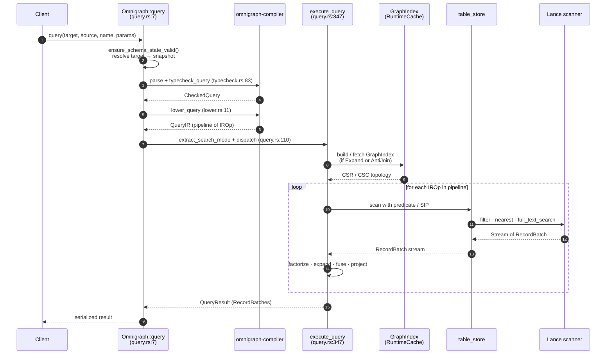

# Query Execution, Mutations, and Loading

## Query execution (`exec/query.rs`)

Pipeline:

1. Parse + typecheck via `omnigraph-compiler`.
2. Lower to IR.
3. If `Expand` or `AntiJoin` is present, build (or fetch from `RuntimeCache`) a `GraphIndex` **scoped to the edge types the query actually traverses** (`referenced_edge_types`, recursing through `AntiJoin` inners) — not every edge type in the catalog. The CSR build full-scans each covered edge dataset, so scoping is what keeps a single-edge join (`$x identifiesPerson $p`) from scanning the whole graph's edge data. The `RuntimeCache` key is each covered edge table's **physical identity** `(stable_table_id, incarnation_id, table_key, version, table_branch, e_tag)` (not the resolved snapshot id), so a `{Knows}` index and a `{Knows, WorksAt}` index are distinct entries AND a lazy-fork branch whose edge tables physically *are* main's reuses main's built index instead of cold-scanning it.
4. Run `execute_query` against the snapshot.

### Read flow — sequence



**Code paths:**

- Entry: `Omnigraph::query` at `crates/omnigraph/src/exec/query.rs:31`
- Search-mode extraction: `extract_search_mode` at `crates/omnigraph/src/exec/query.rs:149`
- Pipeline runner: `execute_query` at `crates/omnigraph/src/exec/query.rs:419`
- RRF fan-out: `execute_rrf_query` at `crates/omnigraph/src/exec/query.rs:478`
- Per-source-row BFS: `execute_expand` at `crates/omnigraph/src/exec/query.rs:1297`
- Filter hoist pre-pass: `execute_pipeline` at `crates/omnigraph/src/exec/query.rs:749` — search filters and single-binding pushable scalar filters move onto the introducing `NodeScan` (arming `prefilter(true)` for any search on the same scanner) or into the introducing `Expand`'s `dst_filters`; multi-binding and non-pushable filters stay in-memory at their lowered position
- Lance scan + pushdown: `execute_node_scan` at `crates/omnigraph/src/exec/query.rs:2328`
- Filter → Expr pushdown: `build_lance_filter_expr` at `crates/omnigraph/src/exec/query.rs:2594`

### Multi-modal search modes (`SearchMode`)

The executor recognizes three modes that may be combined in a single query:

- **`nearest`** — vector ANN (uses Lance vector index; `LIMIT` required).
- **`bm25`** — BM25 over an inverted index.
- **`rrf`** — Reciprocal Rank Fusion of two rankings, with k (default 60).

Hybrid example: `order { rrf(nearest($d.embedding, $q), bm25($d.body, $q_text)) desc } limit 20`.

### Joins / set operations

- Joins are implicit: MATCH bindings + traversals are implemented as scans + CSR/CSC lookups.
- A traversal with an edge binding (`$p $w:knows $f`) bypasses both unbound expand modes: it always scans the edge dataset (`execute_expand_bound` — CSR holds topology only, not edge properties), emits one row per matching edge row, and never triggers the lazy `GraphIndex` build on its own. It preserves the incoming wide-row order (including ANN/BM25 rank) and carries the physical edge ID as a hidden ordering tie-break so parallel rows remain deterministic.
- `not { … }` lowers to an `AntiJoin` over the inner pipeline.

### Scoped reads

- `query(target, source, name, params)` — at any branch or snapshot.
- `run_query_at(version, …)` — direct historical query at a manifest version.

### Concurrency

- Snapshot isolation per query: all reads inside a query use the same `Snapshot`.
- Readers and writers on different branches don't block each other.

## Blob cell read facade (`blob.rs` / `db/omnigraph.rs`)

`Omnigraph::read_blob_at` is the engine-owned single-cell read boundary. It
accepts one `ReadTarget` and one logical node/edge `BlobCell`; the removed
`Omnigraph::read_blob`/`lance::dataset::BlobFile` surface has no compatibility
wrapper. Bulk export and row-rewrite paths keep their batched Lance readers and
share the descriptor decoder—they must not loop over this single-cell facade.

The read sequence is:

1. Resolve the branch or snapshot, capture the handle's current accepted
   catalog, and bind one exact manifest/table version.
2. Resolve the current type/property aliases to stable table, incarnation, and
   property identity. After a pure type rename, the current type alias binds to
   pre-rename table history through stable table/incarnation identity; the old
   alias is not retained. Phase 1 does not bridge the current property alias to
   a differently named physical field in a pre-rename version. That historical
   read and the retired alias are typed `BadRequest`, never a field-position
   fallback. The type-alias binding is structural only; the following
   incarnation and property-lifetime fences remain independent.
3. Prove the selected physical manifest incarnation. An explicit snapshot's
   reopened manifest must still carry the resolved commit in its exact
   graph-head row; this closes same-name/same-version graph-ref ABA even when
   the table is inherited from main. An entry with a persisted object-store
   manifest e-tag must still open at that exact e-tag, but the e-tag is not a
   sufficient table-branch-incarnation witness. V6 does not persist Lance's
   native `BranchIdentifier` for historical entries, so a named-native-branch
   table bypasses the held-handle cache and is followed by a cold proof that the
   selected graph ref's effective head still equals the captured graph commit.
   The zero-cache control session is used instead of the handle's warm read
   coordinator. A concurrent branch advance may make a branch-owned read fail
   loudly rather than retarget; an older branch-owned snapshot fails
   `BadRequest` with `no persisted native-branch incarnation witness`. Genuine
   inherited-main history remains eligible after the graph-snapshot proof. The
   property/schema checks still apply independently.
4. Validate physical property lifetime. Physical user fields newly initialized,
   added, or schema-rebuilt by 0.10 carry decimal
   `omnigraph.stable_property_id` metadata, which must equal the catalog
   identity; a same-name drop/re-add mismatch is `BadRequest` and malformed
   metadata is `BlobIntegrity`. Never infer graph identity from Lance field ID
   or position. Schema-preserving `LoadMode::Append`, `LoadMode::Merge`, and
   mutation writes retain an unmarked pre-0.10 v6 schema. Full-table
   `LoadMode::Overwrite` carries the 0.10 catalog schema and adopts the marker
   on its replacement fields without rewriting older versions. For an unmarked
   field, an explicit snapshot is admitted only when its complete physical table
   entry equals the current branch entry; older entries fail `BadRequest` with
   `no persisted property-lifetime witness`, even when no rename occurred.
5. Locate physical `id` through a typed `col("id").eq(lit(id))` expression and
   retain the selected stable row ID. Caller text is never flattened into SQL.
6. Fetch and centrally decode the persisted Blob-v2 descriptor. Parent Arrow
   validity is the sole null witness. Malformed shape, kind, child validity, URI,
   or range becomes `BlobIntegrity { reason }`, not `NotFound`, null, or an
   opaque Lance string.
7. Return an external descriptor immediately with zero source-object I/O, or a
   managed reader bound to the captured table version and row ID.

The current-head reads in steps 3 and 4 are admission witnesses only. Row,
descriptor, ETag, and payload data always come from the immutable selected
target; a compatibility check never retargets the read to live branch data.

Managed ETags hash the exact bytes
`omnigraph/blob-etag/v1\0 || stable_table_id_be || table_incarnation_id_be ||
stable_property_id_be || table_version_be || stable_row_id_be ||
manifest_transaction_file_utf8_len_be || manifest_transaction_file_utf8`.
Every numeric value is a big-endian `u64`; the final bytes are the exact
non-empty `transaction_file` identity stored in the immutable opened Lance
manifest, without normalization or a terminator. The public token is the first
16 SHA-256 bytes as lowercase hex wrapped in quotes. An unrelated write to the
same table may therefore change the token even when the cell bytes are
unchanged. Exact numeric version plus immutable manifest identity closes
same-version branch delete/recreate ABA without widening the token to graph
snapshot granularity. A missing or empty witness is `BlobIntegrity { reason }`,
never a weaker token.

`BlobReader::read_range` uses half-open ranges and accepts exactly
`start <= end <= len`, including `len..len`. Reversed or out-of-bounds requests
return `BlobRangeNotSatisfiable { start, end, length }`. Each successful call is
bounded by `BLOB_READ_RANGE_MAX_BYTES` (4 MiB); a wider in-bounds request returns
`ResourceLimitExceeded` for `Blob read range bytes` before payload I/O. Larger
values are pulled through consecutive calls, so this public boundary has no
unbounded `read_all` route.

Branch advance cannot retarget an already-returned reader. Branch deletion and
physical tree reclamation are destructive boundaries, like cleanup: Phase 1
adds no durable/cross-process reader lease. The reader never retargets, but an
uncached later range may fail loudly after reclamation. It can never produce
newer or partial plausible bytes.

## Mutation execution (`exec/mutation.rs`)

Resolves expression values to literals, converts to typed Arrow arrays (`literal_to_typed_array(lit, DataType, num_rows)`), then writes via Lance's two-phase distributed-write API at end-of-query. Before lowering/execution, one `WriteTxn` captures the target's Lance-native branch identity, exact optional graph head, accepted schema identity/catalog, and base table snapshot; every step in the attempt uses that immutable authority.

- `insert` (generated-ID nodes and edges) → accumulate into `MutationStaging.pending` (`StrictInsert`); `stage_all` later calls the exact-`id` fenced `stage_keyed_write` once per touched table.
- `insert` (`@key` node) → accumulate into `pending` (`Upsert`); `stage_all` later calls the same fenced adapter with upsert semantics.
- `update` → scan committed via Lance + pending via DataFusion `MemTable` (read-your-writes), apply assignments, accumulate into `pending` (`Upsert`).
- `delete` → records a predicate into `MutationStaging.delete_predicates` (count matching committed rows now for `affected_*`); `stage_all` combines a table's predicates into one `stage_delete` (Lance 7.0 `DeleteBuilder::execute_uncommitted`, a deletion-vector transaction) — no inline HEAD advance (MR-A).

**D₂ parse-time rule.** A single mutation query is either insert/update-only or delete-only. Mixed → reject before any I/O. The check fires in `enforce_no_mixed_destructive_constructive(&ir)` inside `execute_named_mutation`.

Multi-statement mutations are atomic at the publisher commit boundary. Every batch lives in memory until all statements and validation succeed; `stage_all` then prepares one exact transaction per touched table without advancing HEAD. `commit_all` acquires the root-shared schema → branch → sorted-table gates, rechecks for recovery intent, revalidates the complete branch authority, writes the identity-bearing v9 recovery sidecar, and commits the table transactions with zero transparent conflict retries. The guards remain held while `ManifestBatchPublisher` publishes the pre-minted lineage under the same exact native-branch/head and table-version precondition.

For pure inserts, the keyed adapter may also persist the inductive transaction
property `omnigraph.insert_absence = "v1"`. StrictInsert mints it only after its
exact target-ID preflight. An Upsert may mint it only when Lance's completed
statistics prove that one attempt inserted every input row and updated,
deleted, and skipped zero rows; inability to certify an otherwise valid upsert
is only an optimization miss. The certificate is accepted later only with the
exact parent and UUID, an insertion-only filtered `Operation::Update`, the full
nested schema field-ID preorder, and exact fragment `physical_rows` totals.
The marker is non-cryptographic; raw Lance graph-table writers remain outside
the supported writer topology.

### Mutation flow — sequence

```mermaid
sequenceDiagram
    autonumber
    participant client as Client
    participant og as Omnigraph::mutate_as<br/>(mutation.rs)
    participant cmp as omnigraph-compiler
    participant stg as MutationStaging<br/>(exec/staging.rs)
    participant ts as table_store
    participant rec as identity-bearing v9 recovery sidecar
    participant pub as ManifestBatchPublisher

    client->>og: mutate_as(branch, source, name, params, actor_id)
    og->>og: heal/reject recovery intent; open_write_txn
    og->>cmp: parse + typecheck + lower using txn catalog
    cmp-->>og: MutationIR
    og->>og: enforce_no_mixed_destructive_constructive (D₂)
    loop for each mutation op
        og->>og: resolve literals + build batch
        alt insert / update (accumulate)
            og->>ts: open dataset @ pre-write version (first touch)
            og->>stg: ensure_path + append_batch (PendingMode)
            opt update — scan committed + pending
                og->>ts: scan_with_pending (Lance + DataFusion MemTable union)
                ts-->>og: matched batches
            end
        else delete (record predicate; D₂ keeps separate)
            og->>ts: count_rows (committed match → affected_*)
            og->>stg: ensure_path + record_delete (predicate)
        end
    end
    og->>og: validate complete staged change-set against txn base
    og->>stg: stage_all(db, branch)
    loop per touched table
        stg->>ts: stage_keyed_write OR stage_overwrite OR stage_delete (one per table)
        ts-->>stg: exact staged transaction (no HEAD movement)
    end
    stg->>stg: acquire schema → branch → sorted-table gates
    stg->>og: recheck recovery barrier + revalidate complete WriteTxn
    alt authority changed before effects
        stg-->>og: ReadSetChanged
        alt retryable pre-effect authority movement
            og->>og: discard complete attempt; bounded full reprepare
        else strict Update/Delete/Overwrite authority conflict
            og-->>client: ReadSetChanged (409)
        end
    else authority unchanged
        stg->>rec: persist fixed lineage + exact transaction identities
        loop per touched table
            stg->>ts: commit_staged (zero transparent retries)
            ts-->>stg: achieved transaction OR typed retryable conflict
        end
        alt every table effect succeeded
            stg-->>og: updates + expected versions + sidecar + held gates
            og->>pub: publish exact graph-head/table precondition
            alt publish succeeds
                pub-->>og: new manifest version
                og->>rec: delete sidecar
                og-->>client: MutationResult
            else any error after an effect
                pub-->>og: error
                og-->>client: RecoveryRequired (sidecar remains authoritative)
            end
        else retryable keyed commit conflict and no participant has an owned effect
            stg->>rec: finalize effect-free intent
            stg->>ts: fresh exact-ID probe (strict)
            stg-->>client: KeyConflict (exact match) OR full reprepare (strict no-match / upsert)
        else earlier effect or ownership ambiguous
            og-->>client: RecoveryRequired (sidecar remains authoritative)
        end
    end
```

**Code paths:**

- Entry: `Omnigraph::mutate_as` at `crates/omnigraph/src/exec/mutation.rs`
- Per-mutation orchestration: `mutate_with_current_actor` at `crates/omnigraph/src/exec/mutation.rs`
- D₂ check: `enforce_no_mixed_destructive_constructive` (in the same file)
- Per-op execution: `execute_insert`, `execute_update`, `execute_delete_node`, `execute_delete_edge`
- Pending-aware reads: `TableStore::scan_with_pending` / `count_rows_with_staged` at `crates/omnigraph/src/table_store.rs`
- Edge cardinality with pending: the unified evaluator in `crates/omnigraph/src/validate.rs` (`open_cardinality` / `evaluate_cardinality`), shared by mutation, load, and merge
- Per-query accumulator and protocol adapter: `crates/omnigraph/src/exec/staging.rs` (`MutationStaging::stage_all`, `StagedMutation::commit_all`)
- End-of-query Lance operations: `TableStore::stage_keyed_write`, `stage_overwrite`, `stage_delete`, and `commit_staged` at `crates/omnigraph/src/table_store.rs`. BranchMerge separately feeds actual new/changed chunks capped at 8,192 rows / 32 MiB through a pre-minted keyed chain of at most 1,024 logical data transactions per table; exact recovery scans at most 1,026 versions to reserve backward-compatible headroom for one legacy index tail and one restore. Current merges build no indexes inline. When every link in a complete insertion-only source interval carries and structurally satisfies v1, its opaque `ProvenInsertChunk` route uses `stage_proven_strict_insert`: no target-ID preflight or target merge join. Public Lance `InsertBuilder` stages only fragment files; its uncommitted Append descriptor is replaced by another filtered, certified `Update`, so no Append is committed and a second branch generation remains provable. Source and existing-target native incarnations are revalidated under the final gates. A first-touch lazy target keeps the ref-only fork path; missing/unfamiliar history falls back to the ordered diff. Generic Append/merge-insert helpers are test-only.
- Manifest commit primitive: `commit_updates_on_branch_with_expected` at `crates/omnigraph/src/db/omnigraph/table_ops.rs` (exact native-branch/head precondition plus expected table versions)

Atomicity guarantee for multi-statement mutations: a mid-query failure leaves Lance HEAD untouched because no effect occurs during statement execution or staging. The RFC-023 keyed adapter fixes the physical key to `id`. StrictInsert exact-probes the target and stages a join-free, exact-`id`-filtered insertion-only `Update`; Upsert forces pinned Lance's v2 MergeInsert route. Each arm verifies its emitted operation and filter. Mutation/Load keeps one keyed transaction per touched table and rejects accumulated strict-insert or upsert input above 8,192 rows or 32 MiB before sidecar arm with typed `ResourceLimitExceeded`. Update predicate results stream into the remaining table budget after pending-key shadowing; blob sizes are checked before payload reads. Strict insertion first probes the pinned target: an existing ID is typed `KeyConflict`. A retryable commit conflict may be treated as effect-free only when every participant still has no owned Lance effect; the intent is then finalized and a fresh manifest-visible probe must find one of the attempted IDs before strict insert returns terminal `KeyConflict`. Without that exact match, the broad substrate conflict becomes internal `ReadSetChanged` and the strict operation fully reprepares without changing mode, never reporting a false duplicate. Upsert likewise discards the entire attempt for bounded reprepare and revalidation. An unrelated pre-effect authority movement may also cause a retryable writer to reprepare—including load `Append`—but its semantics remain `StrictInsert`; a detected key conflict is never retried or changed to upsert. If any earlier participant advanced, or absence is ambiguous, the fixed sidecar remains and the result is `RecoveryRequired`. See [docs/dev/invariants.md](invariants.md) and [docs/dev/writes.md](writes.md).

## Bulk loader (`loader/mod.rs`)

- **JSONL only** in v1, with two record shapes:
  - Node: `{"type":"NodeType", "data":{…}}`
  - Edge: `{"edge":"EdgeType", "from":"src_id", "to":"dst_id", "data":{…}}`
- Lines starting with `//` are treated as comments.
- Schema validation on every row (typecheck, required props, blob base64 decoding).
- Edge endpoint resolution by node `@key`.

## Load modes (`LoadMode`)

| Mode | Semantics | Path (post-MR-794) |
|---|---|---|
| `Overwrite` | Replace all data in the target tables on the branch | Same accumulator; one staged Lance `Operation::Overwrite` transaction per touched table. A pre-effect authority change is strict `ReadSetChanged`; no automatic replay. |
| `Append` | Strict insert by `id`: every input row must be absent from the pinned target. It never changes an existing row. | One exact-`id` fenced `stage_keyed_write(StrictInsert)` per touched table. An existing or freshly re-probed effect-free concurrent match returns typed `KeyConflict`; a broad storage conflict without an exact match does not. |
| `Merge` | Upsert by `id` (last occurrence in the input wins). | One exact-`id` fenced `stage_keyed_write(Upsert)` per touched table. An effect-free retryable conflict discards the complete parsed/validated attempt and triggers bounded full reprepare; no staged batch is replayed against a new base. |

Append and Merge retain one keyed transaction per table: either mode is refused
before recovery arm when one table exceeds 8,192 rows or 32 MiB. For a large
incremental load, split the input explicitly into separately atomic graph
commits; use Overwrite for an initial bulk replacement. All three modes then
use the same schema → branch → sorted-table gate, v9 recovery envelope
(retaining the `protocol_v3` payload), zero-retry table commit, and exact
publisher-precondition path as mutation. A parse, resource-limit, RI,
cardinality, or validation failure leaves Lance HEAD untouched. After any table
effect, any later error is `RecoveryRequired`. Load, mutation, and schema apply
build no physical indexes inline; explicit `ensure_indices`/`optimize`
reconciliation materializes declared intent later.

For Blob URI inputs, Append and Merge materialize the referenced bytes before
keyed staging because Lance's merge-insert builder exposes no `WriteParams`
hook. The adapter sums declared ranges or object sizes first and returns the
same pre-arm resource error above 32 MiB without reading payload bytes.
Overwrite does accept `WriteParams` and preserves the external reference.

`Append` is a user-facing mode name, not the selected Lance operation. On the
current v6 format it follows the strict-insert contract and routes through
filtered merge-insert with
`WhenMatched::Fail`; bare Lance `Append` is unreachable from production graph
writes. Use `Merge` when an existing `id` should be updated. This distinction is
part of the public mutation contract, not an optimization choice.

## Load entry points and deprecated ingest compatibility

- `load_graph_batch_as(branch, base, data, mode, actor)` is the canonical strict graph-batch boundary. Each nonblank line is exactly one logical node or edge envelope; recursive duplicate members, unknown or physical fields, compatibility coercions, and noncanonical supplied node IDs are rejected before effects. It still uses the ordinary Load transaction, validation, recovery, and single graph publication.
- `load_graph_batch(branch, data, mode)` is its convenience wrapper with `base: None` and no actor.
- `load_as(branch, base, data, mode, actor)` retains the loader-compatible parser for SDK and legacy-wire compatibility. It shares the same transaction machinery but is not the strict public graph-batch grammar.
- `load(branch, data, mode)` is the loader-compatible convenience wrapper with `base: None` and no actor.
- For either boundary, `base: Some(b)` forks a missing `branch` from `b` first (via `branch_create_from_as`, which enforces `BranchCreate`); `base: None` requires the branch to exist. The result is `LoadResult { branch, base_branch, branch_created, nodes_loaded, edges_loaded }`.
- `ingest{,_as,_file,_file_as}` are `#[deprecated]` shims over loader-compatible `load_as`, preserving the historical contract (`from: None` forks from `main`; returns `IngestResult`). The CLI `ingest` command likewise retains that compatibility path; it is not an alias for strict CLI `load`.

## Embeddings during load

The loader does **not** embed `@embed` properties at load time. `@embed` is a catalog annotation consumed by query typecheck/lint; vectors are supplied directly in the load data, or pre-filled by the offline `omnigraph embed` pipeline. Query-time `nearest($v, "string")` auto-embeds the query string via the provider-independent embedding client. See [embeddings.md](../user/search/embeddings.md). (Ingest-time `@embed` execution is a planned RFC-012 phase.)
