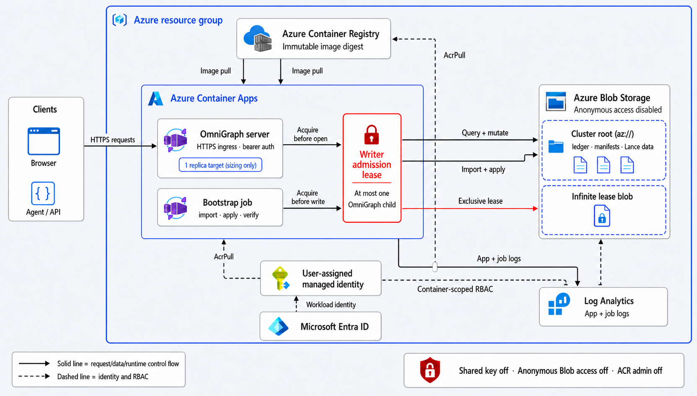

# RFC 0029: Native Azure Blob storage

| | |
|---|---|
| **Status** | Accepted |
| **Author track** | Public contribution |
| **Author(s)** | Roey Zalta ([@roy2392](https://github.com/roy2392)) |
| **Discussion** | [ModernRelay/omnigraph#439](https://github.com/ModernRelay/omnigraph/discussions/439) |
| **Implementation** | Not yet implemented |

## Summary

Add Azure Blob Storage as a native OmniGraph storage backend, addressed by
`az://<container>/<prefix>` URIs and implemented through the existing Lance and
Apache Arrow `object_store` abstractions. The default binaries and container
image will understand Azure roots, use the same manifest, recovery, and storage
adapter paths as local and S3 roots, and authenticate without storage keys when
running under Azure managed identity. A checked-in Azure Container Apps
reference deployment will preserve OmniGraph's existing one-live-writer-process
boundary with an infinite Azure Blob process-admission lease, rather than
treating Container Apps replica targets as a correctness guarantee. Repeatable
Azurite plus adversarial live-Azure evidence will define the supported
deployment boundary.

## Motivation

OmniGraph currently documents local filesystems and S3-compatible object stores.
An Azure operator can run a separate S3-compatible service or mount Azure Files,
but neither is a native Azure Blob deployment. Those approaches miss the main
operational reasons Azure customers choose the platform: Microsoft Entra RBAC,
managed identity, Blob-native conditional writes, and infrastructure that can be
deployed and audited with Azure-native tooling.

The concrete need is to deploy a company knowledge graph entirely on Azure and
be able to show customers a maintained, reproducible path rather than a private
fork. "The Lance data files happen to be portable" is not enough. The cluster
ledger, lock, approvals, catalog, recovery sidecars, graph manifests, and data
tables must all use the Azure backend, and the deployment must prove restart
persistence and authorization behavior.

The long-run liability is kept small by extending existing substrate seams:

- The [Lance object-store integration](https://lance.org/guide/object_store/)
  already supports Azure URIs and owns dataset I/O.
- Apache Arrow's [`object_store` Azure module](https://docs.rs/object_store/0.13.2/object_store/azure/),
  already used by `omnigraph-storage`, implements Azure Blob,
  ETag-conditioned update, conditional create, listing, copy, and delete.
- OmniGraph keeps one storage adapter and one graph publication/recovery path;
  it does not add an Azure SDK, cloud-specific manifest, or Azure-only engine.
- Authentication remains configuration at the storage boundary, not graph
  state or a new secret format.

## Scope and non-goals

This RFC includes:

- `az://` roots anywhere an S3/object-store root is accepted; capabilities
  intentionally restricted to the local filesystem remain local-only;
- Azure support in both Lance dataset I/O and OmniGraph control-object I/O;
- managed identity as the recommended production authentication path;
- deterministic integration tests against Azurite and a documented live-Azure
  deployment proof;
- an Azure Container Apps reference deployment with a one-replica sizing target
  and one Blob-leased writer-admission wrapper shared by the app and bootstrap
  job;
- user, CLI, deployment, and contributor documentation for the new backend.

This RFC does not:

- promote multi-process writers, overlapping writer recovery, or multi-replica
  mutation serving to supported status;
- present the deployment lease as an engine-level fencing token or make
  arbitrary unwrapped writers safe;
- introduce a second graph format, Azure-specific manifest rows, or an Azure
  data migration protocol;
- add an Azure Files/POSIX storage backend;
- add native Key Vault bearer-token loading or change server authentication;
- certify every Azure compute service, sovereign cloud, private-network shape,
  or ADLS Gen2 URI alias in the first delivery;
- make `abfs://`, `abfss://`, or HTTPS Blob URLs public OmniGraph storage URI
  aliases.

## Guide-level explanation

### URI and cluster configuration

An Azure-backed cluster uses one Blob container and an optional object prefix:

```yaml
# cluster.yaml
version: 1
storage: az://omnigraph/clusters/company-brain
graphs:
  company:
    schema: schema.pg
```

The container is the URI authority. The storage account is deliberately not in
the URI; it comes from the environment so the same declaration can move between
accounts without embedding credentials or account-specific endpoints:

```bash
export AZURE_STORAGE_ACCOUNT_NAME=companybrainprod
export AZURE_STORAGE_CLIENT_ID=<user-assigned-managed-identity-client-id>

omnigraph cluster validate --config ./company-brain
omnigraph cluster import --config ./company-brain
omnigraph cluster apply --config ./company-brain --as operator@example.com

OMNIGRAPH_SERVER_BEARER_TOKEN="..." \
  omnigraph-server \
  --cluster az://omnigraph/clusters/company-brain \
  --bind 0.0.0.0:8080
```

`AZURE_STORAGE_ACCOUNT_NAME` is required for real Azure Blob Storage. On Azure
Container Apps, `IDENTITY_ENDPOINT` and `IDENTITY_HEADER` are injected by the
[managed-identity runtime](https://learn.microsoft.com/en-us/azure/container-apps/managed-identity).
`AZURE_STORAGE_CLIENT_ID` selects the intended user-assigned identity.
That identity receives `Storage Blob Data Contributor` scoped no wider than the
deployment requires.

For local tests, Azurite uses the upstream builder's emulator contract:

```bash
export AZURE_STORAGE_USE_EMULATOR=true
export AZURE_STORAGE_ACCOUNT_NAME=devstoreaccount1
# Optional when Azurite is not at its default address:
export AZURITE_BLOB_STORAGE_URL=http://127.0.0.1:10000
```

Account keys, SAS tokens, client credentials, workload identity, bearer tokens,
and Azure CLI credentials remain available where the pinned `object_store`
builder supports them. The production reference path certifies managed identity;
the hermetic test path certifies Azurite. Documentation must not imply that every
upstream credential combination receives OmniGraph integration coverage.

### Canonical URI semantics

The first public Azure form is exactly:

```text
az://<container>[/<object-prefix>]
```

- `<container>` is required and must be valid for Azure Blob Storage.
- The object prefix may be empty, although a dedicated cluster prefix is
  recommended.
- The storage backend accepts an empty prefix, but the Container Apps reference
  deployment requires a non-empty dedicated prefix and rejects the reserved
  top-level `__omnigraph_azure_admission/` namespace so its admission object
  stays unambiguous and outside graph-root cleanup.
- A trailing slash on a root is normalized away, matching S3 root behavior.
- Joining graph and control paths appends slash-delimited object keys beneath
  the captured root.
- One adapter is scoped to one container. A URI naming another container is a
  typed mismatch, not an implicit second client.
- Query strings, fragments, embedded credentials, and unsupported Azure aliases
  are rejected rather than interpreted.

The account and endpoint are configuration, not URI identity. Within one
process, users must not point the same normalized `az://` root at different
accounts. Changing those environment values requires a process restart, just as
changing S3 endpoint configuration does.

### Azure Container Apps reference deployment



The checked-in deployment creates or connects the following resources:

- an Azure StorageV2 account and private Blob container;
- an Azure Container Registry for the built image;
- one user-assigned managed identity;
- `Storage Blob Data Contributor` for that identity scoped to the cluster
  container and `AcrPull` scoped to the registry;
- a Log Analytics workspace and Container Apps environment;
- one deployment-owned writer-admission Blob in a reserved container-level
  namespace outside the canonical cluster prefix; and
- an externally reachable Container App with HTTPS ingress, `/healthz` probes,
  a secure bearer-token secret, and a one-replica sizing target.

The app receives `AZURE_STORAGE_ACCOUNT_NAME` and
`AZURE_STORAGE_CLIENT_ID`; the canonical cluster root is passed as the
`--cluster` argument. It does not receive a storage account key. The storage
container remains private, and deployment output must not print the server
bearer token or any credential.

In this first public-cloud topology, "private" means anonymous Blob access is
disabled (`allowBlobPublicAccess = false`), shared-key authorization is
disabled, and runtime access uses Microsoft Entra ID plus container-scoped
RBAC. The Azure Blob public service endpoint remains enabled. Private endpoints
and VNet integration are explicitly outside this first support boundary.

Azure documents that replica quantities are
[targets, not guarantees](https://learn.microsoft.com/azure/container-apps/scale-app),
and that platform maintenance can temporarily pre-warm extra replicas.
`minReplicas = 1` and `maxReplicas = 1` are therefore sizing and steady-state
assertions only. They are not part of the correctness proof.

Both the serving app and every bootstrap/job execution enter through the same
PID-1 admission path: Tini forwards process-group signals and subreaps orphaned
descendants, while its supervised wrapper owns the lease protocol. Before any
OmniGraph child can open the cluster or run recovery, the wrapper derives one
canonical lock Blob from the exact storage account,
container, and normalized cluster root. It stores that permanent object at
`__omnigraph_azure_admission/v1/<normalized-prefix>/writer.lock`, a reserved
container-level namespace outside the cluster root and its lifecycle cleanup,
and creates it atomically if necessary. It generates a
cryptographically unique proposed lease ID, and positively acquires an
[infinite Blob lease](https://learn.microsoft.com/rest/api/storageservices/lease-blob)
with managed identity. Azure grants only one active lease for that Blob. A
pre-warmed replica, overlapping job execution, or second deployment therefore
stays alive but unready (or exits as a non-serving job) and never starts an
OmniGraph writer. A lost acquire response authorizes no child unless an
exact-ID renew positively proves that this wrapper owns the lease; any still
ambiguous result fails closed.

On `SIGTERM`, the wrapper stops admission, forwards the signal to the complete
child process group, and waits for the HTTP server, in-flight requests,
resident background writers, and descendants to finish. It releases the lease
with the exact owning lease ID only after the child group is gone. A generic
`EXIT` trap may not release a lease without that proof. The Container
Apps termination grace period must exceed that drain budget. An ambiguous
release response fails closed. `SIGKILL`, OOM, host loss, a child that cannot
drain inside the grace budget, or a failed release deliberately leaves the
infinite lease held and the replacement unready rather than risking overlapping
writers. An unexpected server exit or nonzero bootstrap exit also strands the
lease: process death alone does not prove that an already accepted Blob request
cannot still complete. Only a wrapper-initiated graceful drain or a successful
bootstrap with every descendant gone reaches the release path.

The lease is a cooperative deployment admission mutex, not a storage fencing
token: it does not prevent an operator from launching a binary that bypasses
the wrapper, and breaking it cannot fence a paused old process. The reference
deployment never auto-breaks a lease based on time. Recovery requires an
explicit runbook that first freezes new admissions, closes ingress, deactivates
and enumerates every active, inactive, and deprovisioning revision, stops and
enumerates every job execution/replica, and proves stable zero processes beyond
the termination and control-plane consistency windows. If old-process death
cannot be positively established, the runbook must hard-fence the old runtime
(for example, rotate to a fresh identity, revoke the old identity's Blob role,
and wait through authorization propagation and token expiry) before breaking
and observing the lease as unlocked. Zero-downtime rolling mutation serving
remains outside the supported boundary.

## Reference-level design

### Substrate activation

The workspace enables the `azure` feature on the existing `lance` and
`object_store` dependencies. Azure support is part of the normal binaries and
published server image; a URI accepted by the CLI must not fail only because a
packager omitted an undocumented feature.

No new storage crate or Azure SDK is introduced. Lance continues to open all
Lance datasets through its public object-store integration. OmniGraph control
objects continue through `omnigraph-storage::StorageAdapter`.

### Backend selection and path mapping

The shared storage crate adds an `Azure` storage kind and an Azure URI codec:

```text
az://container/a/b.json  ->  container-scoped object path a/b.json
```

The codec performs scheme, container, and non-empty object-key checks at the
point an object is accessed. Root normalization, URI joining, write-queue
identity, graph-root construction, cluster handles, manifest metadata, and
dataset layout all classify Azure with the existing remote-object-store path.
Every exhaustive `Local | S3` decision is reviewed; Azure follows S3 only where
the distinction is genuinely local versus remote, not by accidental fallback.

`MicrosoftAzureBuilder::from_env()` supplies the account, endpoint, and
credential provider, while the container comes authoritatively from the URI.
OmniGraph and Lance consume the same environment contract, preventing the
control plane and dataset plane from silently addressing different accounts.

### Conditional writes and recovery semantics

Azure Blob is marked as supporting conditional update. `object_store` maps:

- `PutMode::Create` to `If-None-Match: *`;
- `PutMode::Update` plus the prior ETag to `If-Match: <etag>`;
- a successful write to a new version token from the returned ETag.

This preserves the strong CAS behavior expected by the cluster ledger, state
lock, and other control objects. A failed precondition is the ordinary CAS-lost
outcome; authentication, throttling, timeout, and transport failures remain loud
storage errors. There is no read-then-overwrite fallback for Azure.

Azure text-object rename uses GET, a visibility-complete PUT, and then DELETE.
This avoids Azure Copy Blob's asynchronous completion window, but the operation
is still not atomic. Recovery paths must continue to tolerate both source and
destination after a crash. Azure contract tests pin immediate destination
visibility; the existing provider-neutral recovery tests retain ownership of
the dual-source/destination crash shape.
Prefix deletion remains list plus delete and is likewise retryable rather than
transactional.

Azure changes only the physical object transport. Lance versions, graph
manifests, the single manifest publication door, recovery sidecars, branch
authority, and internal schema stamps retain their existing meaning.

### Authentication boundary

Authentication stays inside the two upstream storage builders. Tokens are
acquired by the pinned Azure credential provider and are neither persisted in
the graph nor surfaced through OmniGraph APIs. The Azure reference deployment
uses a user-assigned identity so ACR pull and Blob access can be independently
scoped and audited.

The implementation must avoid logging credential-bearing environment values,
SAS query strings, token responses, or Container Apps secret values. URI
validation rejects query-bearing roots, which also prevents SAS credentials
from becoming persisted cluster identifiers.

The admission wrapper keeps its acquired Blob access token, lease ID, and
request files out of the child environment, command arguments, and logs. The
OmniGraph child still receives the Container Apps-managed identity endpoint and
header because its own Azure storage credential provider requires them; those
runtime values must not be logged. Wrapper-owned request files are owner-only
and removed after use.

### Supported process topology

Native Blob conditional writes improve the backend contract but do not close
the known multi-process gaps above it. In particular, process-local recovery
serialization and non-conditional Lance branch-ref deletion remain unchanged.
The supported topology is therefore:

- one lease-admitted writer process for the cluster at a time;
- one Container Apps replica as the steady-state sizing target, while temporary
  extra replicas remain unable to start an OmniGraph child;
- the server, bootstrap job, job retries, and every deployment-supplied writer
  path enter through the same canonical lease wrapper;
- no concurrent CLI load/schema/maintenance writer while the serving process
  may mutate the same graph, and no direct binary/CLI bypass of the wrapper;
- restart recovery after the prior writer has stopped.

Read-only scaling may be designed and evidenced separately. This RFC does not
infer it from Blob consistency or Container Apps routing.

## Tests and acceptance gates

Acceptance of the implementation requires evidence at each changed boundary.

### Unit and storage-contract tests

- selection, normalization, joining, and parsing for `az://` roots;
- refusal of missing/invalid containers, query/fragment credentials, empty
  object paths, and cross-container access;
- the complete shared storage contract against Azurite: read, bounded read,
  overwrite, conditional create, versioned read, winning and losing ETag
  update, existence, direct-child listing, bounded listing, delete, recursive
  prefix delete, and Azure's read/visibility-complete-put/delete rename;
- a concurrency case proving exactly one conditional-create claimant wins and
  a stale ETag cannot overwrite the winner;
- the existing local, in-memory, and S3 suites remain unchanged and green.

### Engine and cluster integration

Against Azurite, tests must exercise more than the control adapter:

1. validate, import, and apply an Azure-rooted cluster;
2. initialize a graph, load data, and run a query through Lance on `az://`;
3. perform a mutation and observe it through a fresh handle;
4. reopen after process state is discarded and recover the same accepted data;
5. inspect the container to prove both cluster control objects and Lance graph
   objects were written beneath the declared prefix.

At least one recovery or stale-CAS scenario must run on the Azure backend so an
emulator-only happy path cannot establish the correctness claim.

### Build, documentation, and infrastructure

- `cargo test --workspace --locked` and the repository's required feature
  matrix pass with Azure compiled into normal artifacts;
- the container image builds from a clean checkout and contains both
  `omnigraph` and `omnigraph-server` with `az://` support;
- Azure infrastructure compiles through `az bicep build` and its deployment
  script has a non-destructive validation mode;
- wrapper tests model simultaneous contenders, unique proposed lease IDs,
  ambiguous acquire/release responses, process-group draining, stuck-lease
  behavior after an ungraceful exit, and refusal to launch the child without a
  positively confirmed acquisition;
- public storage, cluster, CLI, deployment, and contributor docs name Azure's
  support and its single-writer boundary consistently;
- no generated credentials, subscription IDs, tenant IDs, or live resource
  names are committed.

### Live Azure proof

Before the implementation PR is presented as working, the reference deployment
is run in a disposable Azure resource group with managed identity and no storage
key. A checked script must prove:

- the Container App reaches `Ready` with exactly one lease-owning child in
  steady state;
- `/healthz` returns success;
- a protected endpoint returns `401` without a bearer token;
- authenticated graph listing, load or mutation, and query succeed;
- a new Container App revision or explicit restart reads the previously
  committed graph state;
- forced concurrent replicas and overlapping manual job executions produce
  exactly one child interval and never two writer-capable children;
- a long-running mutation plus `SIGTERM` delays successor admission until the
  old process drains and exits;
- a hard-killed lease owner leaves every successor blocked until the runbook
  proves stable zero old processes and explicitly breaks the lease;
- an unexpected server crash or nonzero bootstrap leaves the lease stuck and
  admits no successor child;
- dropped or ambiguous acquire and release responses fail closed, and
  simultaneous waiters produce one winner;
- expected control and Lance objects exist in the private Blob container;
- application logs contain no tokens or storage credentials.

The PR records the image digest, deployment command, UTC time, redacted result
summary, and cleanup result. Cloud resource existence is supporting evidence;
the repeatable scripts and Azurite tests are the durable evidence.

## Invariants and deny-list check

- **Invariant 1 (respect the substrate):** Azure I/O uses public Lance and
  `object_store` features. There is no custom Azure storage engine or private
  Lance API.
- **Invariants 2 and 5 (one publication door and recovery):** backend selection
  does not create a second manifest publisher or recovery protocol. All effects
  retain existing Lance-plus-manifest ordering.
- **Invariant 3 (one accepted view):** URI/account configuration is fixed for
  the process; an operation cannot combine Azure roots or refresh environment
  configuration midway through a captured view.
- **Invariant 6 (strong consistency):** Azure control CAS uses real Blob ETags
  and conditional PUT. Failures are not downgraded to eventual consistency.
- **Invariant 11 (boundary separation):** Azure credentials and deployment
  concerns remain in storage/runtime configuration, outside compiler and engine
  semantics.
- **Invariants 13 and 14 (observable failure and matching evidence):** storage
  failures stay typed and loud; Azurite contract tests and a live managed-
  identity deployment exercise the boundaries being added.
- **Invariant 15 (one source of truth):** Blob is another physical substrate for
  Lance and `__manifest`, not a mirrored store or Azure side registry.

The known single-writer-process gap is not weakened or reclassified. The
reference deployment admits one cooperative process through a fail-closed
infinite lease and documents quiesced upgrades; it does not treat Blob ETags,
replica targets, or the admission lease as a distributed recovery fence inside
OmniGraph.

No deny-list exception is requested. In particular, the design adds no custom
WAL/transaction manager, raw filesystem I/O for cluster state, cloud-only
correctness fork, parallel source of truth, or alternate publication path.

## Compatibility and rollout

`file://` and `s3://` behavior, configuration, and tests remain compatible.
`az://` is additive. Because the stored objects use the existing Lance and
OmniGraph formats, this RFC requires no internal-schema version bump and no
old/new binary format migration matrix.

One fail-closed correction applies to every backend marked as supporting
conditional updates: if a versioned read or successful conditional write omits
an ETag, OmniGraph now returns a storage error instead of synthesizing a content
hash that cannot be used as a valid `If-Match` token. Conforming S3 and Azure
stores are unaffected; an S3-compatible implementation that omitted ETags was
already unable to satisfy the documented strong-CAS contract.

There is no automatic relocation of an existing graph root between backends.
An operator moving data from local or S3 to Azure must quiesce writes and use a
documented export, fresh Azure init/import, load, verification, and cutover
workflow. Raw object copying is not claimed as a supported migration unless a
separate test proves every embedded physical reference remains valid.

Rollout order:

1. land Azure features, URI/storage plumbing, validation, and unit tests;
2. land Azurite storage, engine, cluster, and recovery integration coverage;
3. update all public surfaces and add the Container Apps reference deployment;
4. execute and record the live managed-identity proof;
5. advertise Azure support only after all four gates are present in one release.

## Drawbacks and alternatives

### Continue using an S3-compatible service on Azure

This works today but adds another stateful service and credential model. It
does not provide a native managed-identity-to-Blob path and is not the customer
claim this RFC needs to establish.

### Mount Azure Files and use the local backend

Rejected as the official cloud path. It routes distributed storage through
local-filesystem semantics, including the documented non-cross-process local
CAS behavior, and makes correctness depend on mount and filesystem details that
the engine does not certify.

### Use an Azure-specific SDK directly

Rejected. It would duplicate authentication, retries, conditional-write, and
listing behavior already owned by `object_store`, while risking divergence from
Lance's Azure client.

### Add every Azure URI alias immediately

Rejected for the first delivery. One canonical `az://` form keeps URI identity,
help text, error behavior, and tests exact. `abfs://`, `abfss://`, sovereign-
cloud endpoints, and Fabric/OneLake can be added after their semantics and
credential paths receive their own evidence.

### Do nothing

Operators can keep using local volumes or S3-compatible stores. The cost is
that OmniGraph cannot honestly claim native Azure Blob or keyless Azure
deployment support, which blocks the concrete enterprise deployment need.

## Reversibility

The implementation is mechanically reversible before release because it adds
one backend behind existing abstractions and does not alter stored formats.
After release, `az://` becomes a public URI contract: removing it would strand
otherwise valid roots and therefore requires normal deprecation policy.

Azure-hosted data remains standard OmniGraph/Lance data in ordinary Blob
objects. The transport choice is operationally durable, but it does not create
an Azure-only graph format. The reference infrastructure can be deleted without
changing data semantics, subject to the operator's backup and retention policy.

## Unresolved questions

- Should live-Azure proof remain a maintainer-run release gate, or can the
  project provide a least-privilege CI subscription for periodic validation?
- Which non-public-Azure environments, if any, should be explicitly certified
  after the initial public-cloud and Azurite support lands?
